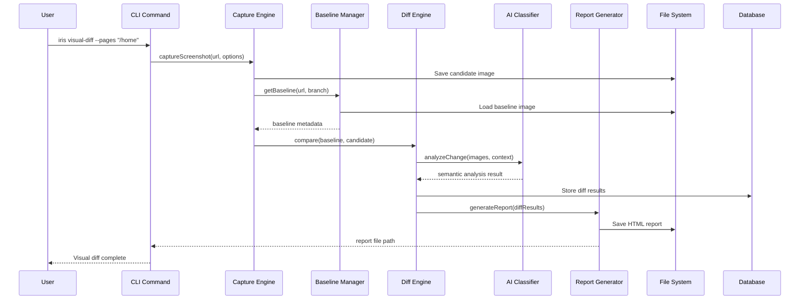
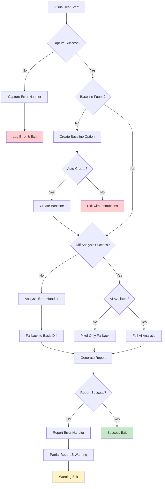

# Phase 2 System Architecture Diagram

## High-Level System Flow

```mermaid
graph TB
    subgraph "Phase 1 Foundation"
        CLI[CLI Commands]
        Browser[Browser Engine]
        Config[Configuration]
        DB[(SQLite Database)]
        AI[AI Client]
    end

    subgraph "Phase 2 Visual Regression"
        Capture[Visual Capture Engine]
        Baseline[Baseline Manager]
        Diff[Diff Engine]
        Classifier[AI Visual Classifier]
        Reporter[Report Generator]
    end

    subgraph "Storage Layer"
        Images[(.iris/baselines/)]
        Reports[(.iris/visual-reports/)]
        Artifacts[(.iris/artifacts/)]
    end

    subgraph "External Services"
        Git[(Git Repository)]
        OpenAI[OpenAI GPT-4V]
        Claude[Claude Vision]
        Ollama[Local Ollama]
    end

    CLI --> Capture
    Browser --> Capture
    Config --> Capture
    Config --> Baseline
    Config --> Diff
    Config --> Classifier

    Capture --> Baseline
    Capture --> Diff
    Baseline --> Git
    Baseline --> Images

    Diff --> Classifier
    Classifier --> AI
    Classifier --> OpenAI
    Classifier --> Claude
    Classifier --> Ollama

    Diff --> Reporter
    Reporter --> Reports
    Reporter --> Artifacts

    Capture --> DB
    Baseline --> DB
    Diff --> DB
    Reporter --> DB

    style "Phase 2 Visual Regression" fill:#e1f5fe
    style "Phase 1 Foundation" fill:#f3e5f5
    style "Storage Layer" fill:#fff3e0
    style "External Services" fill:#e8f5e8
```

## Detailed Component Architecture

```mermaid
graph LR
    subgraph "Visual Capture Pipeline"
        A[Page Load] --> B[Stabilization]
        B --> C[Element Masking]
        C --> D[Screenshot Capture]
        D --> E[Metadata Collection]
        E --> F[Hash Generation]
    end

    subgraph "Baseline Management"
        G[Git Integration] --> H[Branch Detection]
        H --> I[Baseline Lookup]
        I --> J[File Storage]
        J --> K[Metadata Index]
    end

    subgraph "Diff Analysis Pipeline"
        L[Pixel Comparison] --> M[Region Segmentation]
        M --> N[Semantic Analysis]
        N --> O[Classification]
        O --> P[Severity Assignment]
    end

    subgraph "AI Analysis Flow"
        Q[Image Preprocessing] --> R[Vision Model Call]
        R --> S[Response Processing]
        S --> T[Confidence Scoring]
        T --> U[Change Classification]
    end

    F --> I
    K --> L
    P --> Q
    U --> V[Report Generation]

    style "Visual Capture Pipeline" fill:#ffebee
    style "Baseline Management" fill:#e3f2fd
    style "Diff Analysis Pipeline" fill:#f1f8e9
    style "AI Analysis Flow" fill:#fff8e1
```

## Data Flow Architecture



## Integration Points

```mermaid
graph TD
    subgraph "Phase 1 Integration"
        A[CLI Framework] --> B[Enhanced Commands]
        C[Browser Module] --> D[Screenshot APIs]
        E[Config System] --> F[Visual Settings]
        G[Database] --> H[Extended Schema]
        I[AI Client] --> J[Vision Models]
    end

    subgraph "New Phase 2 Modules"
        B --> K[iris visual-diff]
        D --> L[Visual Capture]
        F --> M[Baseline Config]
        H --> N[Visual Tables]
        J --> O[AI Classifier]
    end

    subgraph "External Integrations"
        P[Git Workflow] --> M
        Q[CI/CD Pipeline] --> K
        R[Report Viewers] --> S[Generated Reports]
    end

    K --> L
    L --> M
    L --> N
    L --> O
    O --> S

    style "Phase 1 Integration" fill:#e8eaf6
    style "New Phase 2 Modules" fill:#e0f2f1
    style "External Integrations" fill:#fce4ec
```

## File System Organization

```
.iris/
├── baselines/                 # Git-aware baseline storage
│   ├── main/                 # Main branch baselines
│   │   ├── homepage_desktop.png
│   │   ├── homepage_mobile.png
│   │   └── metadata.json
│   ├── feature-branch/       # Feature branch baselines
│   └── index.db             # Fast baseline lookup
├── visual-reports/           # Generated reports
│   ├── 2025-09-19_143022/   # Timestamped reports
│   │   ├── index.html       # Main report
│   │   ├── assets/          # CSS, JS, images
│   │   └── artifacts/       # Diff images
│   └── latest -> 2025-09-19_143022/
├── artifacts/                # Test run artifacts
│   ├── screenshots/         # Captured screenshots
│   ├── diffs/              # Difference images
│   └── metadata/           # Run metadata
└── config/
    ├── visual.json         # Visual testing config
    └── templates/          # Report templates
```

## API Layer Design

```mermaid
graph TB
    subgraph "Public CLI API"
        A[iris visual-diff]
        B[iris run with --visual]
        C[iris watch --visual-diff]
    end

    subgraph "Internal TypeScript API"
        D[VisualTester Interface]
        E[CaptureEngine]
        F[BaselineManager]
        G[DiffEngine]
        H[AIClassifier]
        I[ReportGenerator]
    end

    subgraph "JSON-RPC Extensions"
        J[visual.capture]
        K[visual.compare]
        L[visual.generateReport]
        M[visual.getBaselines]
    end

    A --> D
    B --> D
    C --> D

    D --> E
    D --> F
    D --> G
    D --> H
    D --> I

    J --> E
    K --> G
    L --> I
    M --> F

    style "Public CLI API" fill:#f3e5f5
    style "Internal TypeScript API" fill:#e1f5fe
    style "JSON-RPC Extensions" fill:#fff3e0
```

## Error Handling Flow



This visual architecture provides a comprehensive view of how Phase 2 visual regression testing integrates with the existing Phase 1 foundation while adding sophisticated new capabilities for intelligent visual analysis.